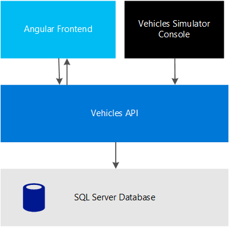
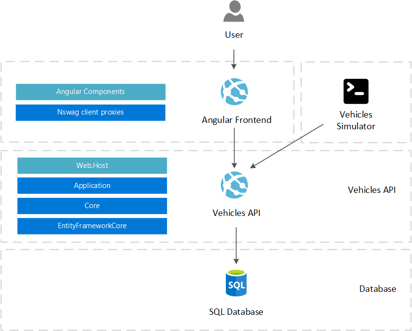

# Architecture

## Design Considerations
- The solution should be modular, extensible and maintainable
- Microservices architecture is used to facilitate adding new business features as new requirements emerges
- In backend services, Domain Driven Design for maintainability
- The solution should be testable
- The solution should be cloud native, fully utilizing platform as a service with no infrastructure effort needed
- The solution is dockerized (containerized) and can be deployed using a container orchestration platform 
## Solution Technologies
The solution will make use of the following technologies:
- **ASP.NET Core** for backend development
- **Angular 7** for frontend development
- **SQL Server** for database
- **ASP.NET Boilerplate** as a framework for domain driven design backend with Angular base template for frontend
- **Signalr** for pushing realtime updates to client
- **Swagger** for exposing API documentation
- **NSwag** for generating client proxies for APIs

## Infrastructure Diagram
The following is an infrastructure diagram that represent the main infrastructure components in the solution:

- **Angular Frontend**: the main frontend that displays a realtime dashboard for vehicles status
- **Vehicles API**: the main service with Vehicles APIs, Signalr notifications and some basic Identity management
- **SQL Server Database**: the main database for the solution
- **Vehicles Simulator**: console application that simulates random pings for vehicles

## Solution Design
The following diagram represent the logical layers that defines solution overall structure and domain driven design principals.

## Cloud deployment options
### Platform as a service (Azure)
Use Azure (or any other cloud provider) the solution can be deployed to utilize no infrastructure services or monitoring by using the following services:
- **Azure App Service**: for hosting the web components and make them auto scaled
- **Azure SQL Database**: for hosting the database
- **Application Insights**: for monitoring the application performance and providing feedback for development team
- **Azure Scheduler and Funtions**: for running the simulator as a background service

### Containers
Use docker-compose for local development, or Kubernetes for production environment orchestration. The solution is fully containerized to allow this kind of cloud native deployment.
The following containers are created:
- **bishoymly/ng** for the angular frontend with nginx
- **bishoymly/host** for the APIs host (aspnet core)
- **bishoymly/simulator** for the simulator app (dotnet core)
- **mcr.microsoft.com/mssql/server** for hosting SQL Server on linux contianer

Check the [docker-compose file](https://github.com/Bishoymly/MonitorV/blob/master/aspnet-core/docker/ng/docker-compose.yml) for more details.

### Function as a service (Serverless)
The solution can be easily converted to Function as a service deployment to utilize a complete serverless operations. By splitting APIs into smaller functions, specifically:
- Get All Vehicles
- Update Vehicle Status

And moving the frontend to a CDN or storage as it's only static files.

